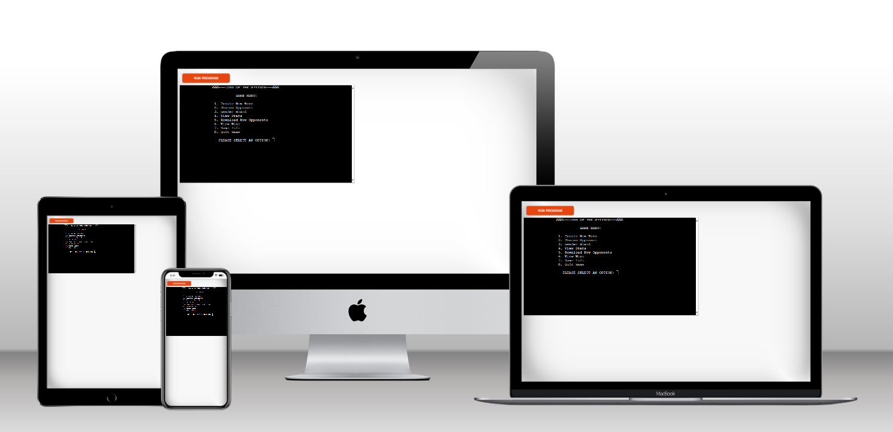
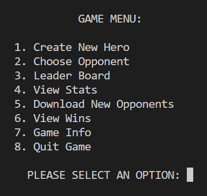
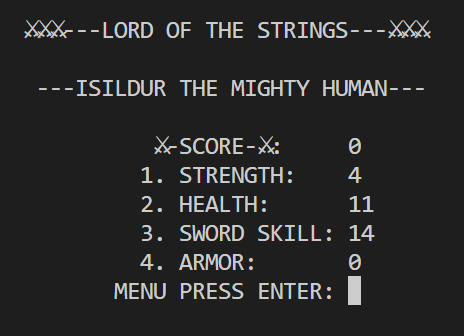

---

# _Lord of the Strings_

The lord of the strings is a console prompt based RPG adventure-game powered by AI storytelling. Create a character with unique abilities, battle fierce oponents and challenge High Score characters from previous players.
The site can be accessed by this [link](https://lord-of-the-strings-1fb32555cef6.herokuapp.com/)

---

## User Stories

### First Time Visitor Goals:

- As a First Time Visitor, I want to easily understand the main purpose of the app, so I can navigate the Game Menu options
- As a First Time Visitor, I want create a character, so I can start playing the game

### Returning Visitor Goals:

- As a Returning Visitor, I want to continue to play and so I can reach further into the quest

### Frequent Visitor Goals:

- As i Frequent Visitor I want to continue practicing so I'll become a seasoned Lord of The Rings master and download more opponents

## How To Play:

- First create your own Character setting Name/Type and abilities before start combatting against opponenents. Before each battle a storyline is created by OPENAI's chat-gpt API giving the user a unique dialogue between the hero and the opponent leading up to the battle. If battle is won the player is rewarde extra abilty points which can be used either to recuperate health or to improve the other abilies such as Strength, Sword Skill or Armor. More opponents can be downloaded if the player wants to continue further. Game Over when Player looses a battle or when all enemies are combatted

## Features

### Game Menu

- Choose option through entering a valid number corresponding to the number printed before the option title. If user input is not valid a message will appear with instructions.

#### Create New Hero

- Enter your Heros name and type Human/Elf/Dwarf/Orc. The initial abilitiy stats Strength/Health/Sword Skill/Armor will be automatically generated based on what type of character chosen. Then extra ability points will be added for the user to deploy as preferred. A Unique Hero is created each time

#### View Stats

- Prints the Hero Name and Ability Stats

#### Choose Opponent

- A list of oppponents are printed in two rows displaying unbeaten opponents to choose from

#### View Wins

- A list of beaten opponents is printed

#### Download New Opponents

- A fresh set of opponents are being fetched through google API allowing the game developer to constantly updating the gaming experience without needing to update the app

#### Reset Opponents to Start Settings

- Removes all previous wins and downloaded opponents and resets the opponents list to the start settings. The players accumulated stats are being kept

#### Quit Game

- Ends the game

## Future Features

- Online battle between players

- Map with story created by chat-gpt placing oppponents in different parts of the world

- Add Character items inventory

## Data Model

- I decided to create a CharacterStats class as my model. The game creates two instances of the class to hold the player's and the opponents stats

- The CharacterStats class stores the Name/Type/Strength/Health/Sword Skill/Armor values

- The class also has methods as **str** to print the character stats in a viewable fashion

## Flow Chart

## Testing

- I have manually tested the project by doing the following:

* Passed the code through a PEP8 linter and confirmed there are no problems
* Given invalid inputs: strings when numbers are expected, out of bounds inputs.
* Tested my local terminal and the Code Institute Heroku terminal

### Bugs

- When I originaly designed the code I updated the Google API after each battle. This caused the API to break because excessive use. fixed this be rearranging the updates to be kept in a list of lists inside the program and passed along as paramiters between the functions.
- The battle logic was to deterministic based on the character stats making the game to predictable. I fixed this by adding a battleDice function to increase unpredectability.
- I originally put the OpenAI key in a key.text file and "gitignored" it. When sent to heroku I was not able to get the API running. I fixed this by adding a .env file and add a new config var in Heroku.

## Remaining Bugs

- No bugs remaining

## Validator Testing

- PEP8

* Noerrors where returned from PEP8online.com

## Deployment

- This project was deployed using Code Institute's mock terminal for Heroku.

* Steps for deployment:

- Fork or clone this repository [link](https://https://github.com/JohanPlAr/lord-of-the-strings/)
- Create a new Heroku app
- Set the buildbacks to Python and NodeJS in thet order
- Link the Heroku app to the repository
- Click on Deploy

## Credits

- Code Institu for the deployment terminal
- Classic non digital roleplaying games such as Dungeons and Dragons, Äventyrsspel(Swedish brand) etc.

## Tools

- [EzGif](https://ezgif.com) was used to resize GIF images.
- [mockupGen](https://websitemockupgenerator.com/) was used for responsive mockup png.
- [Miro](http://www.miro.com/) for flowchart creation.

## Acknowledgments

- [Code Institute](https://codeinstitute.net/) For the Code Institute course material in Python for the Slack community members for their support and help.