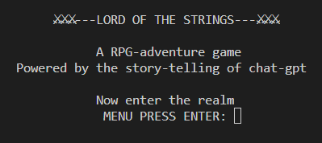
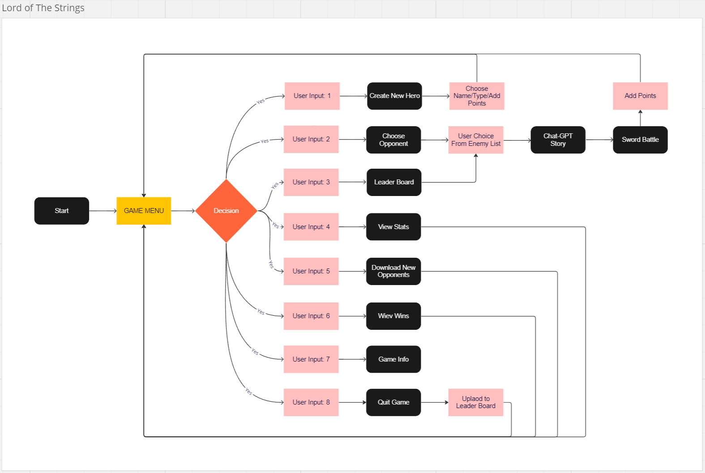

---

# _Lord of the Strings_

Lord of The Strings is a console prompt based RPG adventure-game powered by AI storytelling. Create a character with unique abilities, battle fierce oponents and challenge High Score characters from previous players.
The app can be accessed by this [link](https://lord-of-the-strings-1fb32555cef6.herokuapp.com/)

---

## User Stories

### First Time Visitor Goals:

- As a First Time Visitor, I want to navigate the Game Menu with ease, so I understand the main purpose of the game
- As a First Time Visitor, I want to read the Game Info, so I can understand the result of my choices in the game
- As a First Time Visitor, I want create a character, so I can start playing

### Returning Visitor Goals:

- As a Returning Visitor, I want to improve my strategy so I can reach further into the quest
- As a Returning Visitor, I want to make smarter choices for my characters abilities
- As a Returning Visitor, I want to download new opponents with higher difficulty

### Frequent Visitor Goals:

- As a Frequent Visitor, I want to win enough battles, so I reach the Leader Board
- As a Frequent Visitor, I want to challenge High Score combattants, so I climb higher on the Leader Board
- As a Frequent Visitor, I want to continue practicing, so I'll become a seasoned Lord of The Strings master 

## How To Play:

- First create your own Character setting Name/Type and abilities before start combatting against opponenents. Before each battle a storyline is created by OPENAI's chat-gpt API giving the user a unique dialogue between the hero and the opponent leading up to the battle. After the battle the player is rewarded extra abilty points which can be used either to recouperate health or to improve the other abilities such as Strength, Sword Skill or Armor. More opponents can be downloaded if the player wants to continue further. From the Leader Board the player is able to challange previous players High Score Characters. The player is offered to upload the character to the Leader Board when quitting the game. Only a top 20 score will suffice to enter the list.

## Features

### Title Page

- An introductory print setting the user expectations for the game experience

### Game Menu

- Choose option through entering a valid number corresponding to the number printed before the option title. If user input is not valid a message will appear with instructions.

#### Create New Hero

- Enter your Heros name and type Human/Elf/Dwarf/Orc. The initial abilitiy stats Strength/Health/Sword Skill/Armor will be automatically generated based on what type of character chosen. Then extra ability points will be added for the user to deploy as preferred. A Unique Hero is created each time

#### Choose Opponent

- Prints the Hero Name and Ability Stats

#### Leader Board

- A list of previous players High Scoring characters. Choose a opponent from the list to challenge them in a battle

#### View Stats

- A profile of the players stats are printed for the user to keep track of the development and to be able to assess which opponent they are likely to be able to stand up against

#### Download New Opponents

- A fresh set of opponents are being fetched through google API allowing the game developer to constantly update the gaming experience without needing to update the app

#### View Wins

- A list of beaten opponents is printed

#### Game Info

- Presents information about game functions and game logic. 

#### Quit Game

- Ends the game and offers the option to upload to Leader Board. Score needs to be among the top 20 highest scores.

### Chat GPT-Storyteller

- When the player has chosen an opponent a message is sent via OPENAI:s API to chat-gpt with the following information:
"role": "system", "content": "You are a Storyteller
 f"""Set up a dialouge that leads to {player.name} the {player.char_type}
and {enemy.name} the {enemy.char_type} drawing their weapons and comencing a sword_battle against eachother. Maximum length 70 words"""

OPENAI API then sends a reply which is printed in the console. 

## Future Features

- Online battle between players

- Map with story created by chat-gpt placing oppponents in different parts of the world

- Add Character items inventory

- Involve Chat-GPT in creating scenes, choices and new opponents

- Let Chat-GPT control the path of oppponents

## Data Model

- I decided to create a CharacterStats class as my model. The game creates two instances of the class to hold the player's and the opponents stats

- The CharacterStats class stores the Name/Type/Strength/Health/Sword Skill/Armor/Score values

- The class also has methods as **str** to print the character stats in a viewable fashion

- GSPREAD API is used to store opponents and high score characters data that can be altered by the developer without any change in the code. This allows the game to constantly be updated offering new gaming experiences.

## Random Dice functions

- To create a unique experience each time playing, a dice function simulating a six sided dice is implemented creating the stats.

- To increase unpredictability in the battle I created a dice function that transforms every six in a dice roll to two new dice rolls. The benefit of this is that a underdog opponent has a greater chance to get lucky. This function called battle_dice is only used in the battle function.

## Flow Chart

## Testing

- I have manually tested the project by doing the following:

* Passed the code through a PEP8 linter and confirmed there are no problems
* Given invalid inputs: strings when numbers are expected, out of bounds inputs.
* Tested my local terminal and the Code Institute Heroku terminal

<table>
<thead>
  <tr>
    <th>Testing Description</th>
    <th>Expected Action</th>
    <th>Actual Output</th>
    <th>Result</th>

  </tr>
</thead>
<tbody>
  <tr>
    <td>Title Page Loads</td>
    <td>User is presented with Title Page</td>
    <td>User is presented with Title Page</td>
    <td>Confirmed</td>
  </tr>
  <tr>
    <td>Game Menu Loads</td>
    <td>User is presented with Game Menu</td>
    <td>User is presented with Game Menu</td>
    <td>Confirmed</td>
  </tr>
  <tr>
    <td>Main Menu Option 1</td>
    <td>User is presented with Create Character view</td>
    <td>User is presented with Create Character view</td>
    <td>Confirmed</td>
  </tr>
  <tr>
    <td>Main Menu Option 2</td>
    <td>User is presented with Opponents view</td>
    <td>User is presented with Opponents view</td>
    <td>Confirmed</td>
  </tr>
  <tr>
    <td>Main Menu Option 3</td>
    <td>User is presented with Leader Board view</td>
    <td>User is presented with Leader Board view</td>
    <td>Confirmed</td>
  </tr>
  <tr>
    <td>Main Menu Option 4</td>
    <td>User is presented with Player Stats view</td>
    <td>User is presented with Player Stats view</td>
    <td>Confirmed</td>
  </tr>
     <td>Main Menu Option 5</td>
    <td>User is getting confirmation on download attempt</td>
    <td>User is getting confirmation on download attempt</td>
    <td>Confirmed</td>
  </tr>
     <td>Main Menu Option 6</td>
    <td>User is presented with list of beaten oppponents</td>
    <td>User is presented with list of beaten opponents</td>
    <td>Confirmed</td>
  </tr>
   <td>Main Menu Option 7</td>
    <td>User is presented with Game Info view</td>
    <td>User is presented with Game Info view</td>
    <td>Confirmed</td>
  </tr>
     <td>Main Menu Option 8</td>
    <td>User is presented with Quit Game view</td>
    <td>User is presented with Quit Game view</td>
    <td>Confirmed</td>
  </tr>
  <tr>
    <td>All other input</td>
    <td>Presents error and presents menu</td>
    <td>Presents error and presents menu</td>
    <td>Confirmed</td>
  </tr>
  <tr>
    <td>Create New Hero step 1</td>
    <td>User Enters a name between 2-10 characters long</td>
    <td>User is presented with Type: Input request</td>
    <td>Confirmed</td>
  </tr>
  <td>All other input</td>
    <td>Presents error and presents Name input request</td>
    <td>Presents error and presents Name input request</td>
    <td>Confirmed</td>
  </tr>
  <tr>
    <td>Create New Hero step 2</td>
    <td>User Enters a choice of 1-4 or the name of the Type</td>
    <td>User is presented with initial Character Stats</td>
    <td>Confirmed</td>
  </tr>
    <td>All other input</td>
    <td>Presents error and presents Type input request</td>
    <td>Presents error and presents Type input request</td>
    <td>Confirmed</td>
  </tr>
    <tr>
    <td>Create New Hero step 3</td>
    <td>User Enters number within range of Stats Points </td>
    <td>User is presented with updated Player Stats</td>
    <td>Confirmed</td>
  </tr>
      <td>All other input</td>
    <td>Presents error and presents Type input request</td>
    <td>Presents error and presents Type input request</td>
    <td>Confirmed</td>
  <tr>
    <td>Choose Opponent step 1</td>
    <td>User inputs a number in the range of the list presented</td>
    <td>User is presented with fight or flight input</td>
    <td>Confirmed</td>
  </tr>
   <tr>
    <td>Choose Opponent step 2</td>
    <td>User inputs "1" for fight</td>
    <td>User is presented with the Chat-Gpt story</td>
    <td>Confirmed</td>
  </tr>
     <tr>
    <td>Choose Opponent step 2</td>
    <td>User inputs "2" for fight</td>
    <td>User is presented with the Opponents List</td>
    <td>Confirmed</td>
  </tr>
   <td>All other input</td>
    <td>Presents error and presents Opponents List</td>
    <td>Presents error and presents Opponents List</td>
    <td>Confirmed</td>
  </tbody>
</table>

### Bugs

- When I originaly designed the code I updated the Google API after each battle. This caused the API to break due to excessive use. I fixed this be rearranging the updates to be kept in a list of lists inside the program and passed along as peremiters between the functions.
- The battle logic was to deterministic based on the character stats making the game predictable. I fixed this by adding a battleDice function to increase unpredectability.
- I originally put the OpenAI key in a key.text file and "gitignored" it. When sent to heroku I was not able to get the API running. I fixed this by adding a .env file and add a new config var in Heroku.
- Menu ValueErrors have appeared through out the development of the game and have step by step been removed and replaced with feedback to the user how to correctly prompt.

## Libraries and packages used

- gspread Google API for GoogleSheets
- google.oauth2.service_account Account used to share the worksheets with
- os for clear screen functions
- dotenv for .env secure api-key handling
- time for battle sequences
- random for dice functions
- openai for chat-gpt API message and replies
- textwrap for editing of the longer storyline texts

## Remaining Bugs

- No bugs remaining

## Validator Testing

- PEP8

* No errors where returned from PEP8online.com

## Deployment

- This project was deployed using Code Institute's mock terminal for Heroku.

* Steps for deployment:

- Fork or clone this repository [link](https://https://github.com/JohanPlAr/lord-of-the-strings/)
- Create a new Heroku app
- Set the buildbacks to Python and NodeJS in thet order
- Link the Heroku app to the repository
- Click on Deploy
- Enter API key:s to config vars in Heroku

## Credits

- Code Institute for the deployment terminal
- Classic non digital roleplaying games such as Dungeons and Dragons, Äventyrsspel(Swedish brand) etc.

## Tools

- [VSCode](https://code.visualstudio.com) used to edit the application source code.
- [mockupGen](https://techsini.com/multi-mockup/) was used for responsive mockup png.
- [Miro](http://www.miro.com/) for flowchart creation.

## Acknowledgments

- [Code Institute](https://codeinstitute.net/) For the Code Institute course material in Python for the Slack community members for their support and help. 